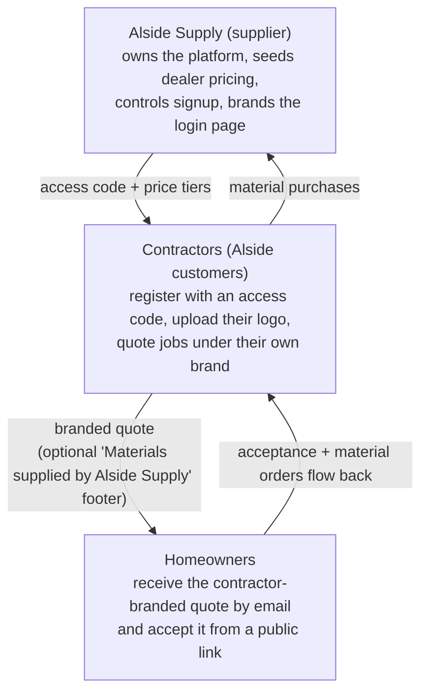

# 1. Overview — What This Application Is

*Part of the [Pro-Quote documentation](README.md).*

**Pro-Quote** is a multi-tenant, supplier-distributed B2B SaaS estimating tool for exterior
remodeling — vinyl/composite siding and replacement windows. It lets a contractor measure a house
(from phone photos, a HOVER report PDF, architectural blueprints, or satellite imagery), produces a
complete priced material + labor takeoff, and sends a branded quote to the homeowner, who can
accept it online.

Its core value proposition, in the creator's own words: it does what **HOVER** (the industry-standard
photo-measurement service) does for **roughly $0.13–$0.30 per AI measurement run instead of ~$150
per HOVER report** — "I just don't get all the pretty pictures."

## Origin

Howard Hunt is a Territory Sales Manager for **Alside Supply** (a building-products supplier in the
Pittsburgh area). He built this app himself on the **Emergent** AI app-building platform over a
period of months, iterating continuously. The business model that emerged:

The strategic upside discussed in the conversation: contractors who quote faster sell more (and buy
more material from Alside); an LP SmartSide executive who saw a demo suggested a manufacturer might
pay six figures for the tool, and Alside was considering demoing it at its national top-contractor
meeting.

## Where It Runs

| Environment | URL |
|---|---|
| Production (published) | `app.pro-quotes.com` |
| Build preview (Emergent) | `app-converter-170.preview.emergentagent.com` |

Hosting on Emergent costs on the order of **$10/month** in platform credits, plus per-run AI costs
(photo measure ~13–30¢; blueprint runs at the top of that range because of multi-pass AI calls).
See [Operating Costs](09-operating-costs.md).

> **Note:** the codebase has since been decoupled from the Emergent platform — AI calls go
> directly to the Anthropic API (`ANTHROPIC_API_KEY`) and the stack self-hosts anywhere via
> Docker Compose (see [System Requirements](08-system-requirements.md)). The Emergent details
> above are kept as historical context.
