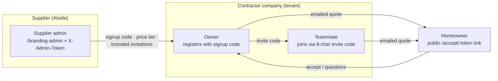

# 2. Users & Personas

*Part of the [Pro-Quote documentation](README.md).*

| Persona | How they use it |
|---|---|
| **Supplier admin** (Howard / Alside sales team) | Hidden admin page at `/branding-admin` (token-gated). Manages supplier branding, the contractor signup code, the four price tiers, per-company tier assignment, bulk price updates (CSV/XLSX upload or across-the-board % bump), and sends branded contractor invitations. Sees quote *counts* per company, deliberately not quote contents. |
| **Contractor owner** | Registers with the supplier's access code → creates a company → uploads logo → sets labor rates in the Catalog → builds estimates → emails quotes → tracks opens/clicks/acceptance. |
| **Contractor teammate** | Joins the owner's company with an 8-character invite code; own login, shared company catalog and estimates. |
| **Homeowner** | Receives the quote email; opens a public accept page (`/accept/:token`), reviews the branded quote (English or Spanish), and accepts with an optional note — which emails the contractor back. |

