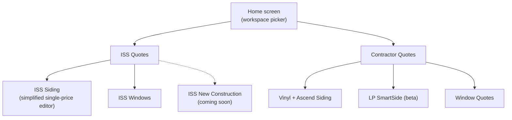
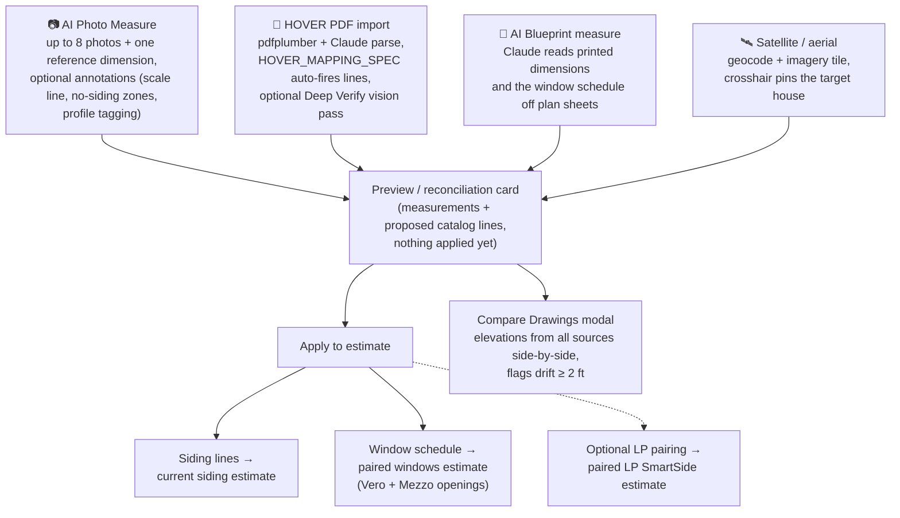

# 3. Usage

*Part of the [Pro-Quote documentation](README.md).*

## 3.1 Getting started (contractor)

1. **Register** at `/login?mode=register`. Creating a *new* company requires the supplier's signup
   code (e.g. `ALSIDE-XXXXXX`, rotatable via env); *joining* an existing company requires that
   company's invite code instead.
2. **Set up your company** on the **Team** page: company name, logo upload, and copy your invite
   code for teammates.
3. **Set labor rates** on the **Catalog** page. Material prices come from the price tier the
   supplier assigned to your company (shown as a locked "Tier" badge); labor and per-line material
   overrides are yours. Saved catalog values flow into every subsequent estimate.
4. **Create an estimate.** The home screen is a workspace picker:

## 3.2 Building an estimate

The estimate editor is organized as **product-line tabs** over shared **sections** of line items:

| Tab | Product |
|---|---|
| Vinyl | Vinyl siding (Alside) |
| Ascend | Alside's composite siding product |
| LP Smart | LP SmartSide engineered wood (separate manufacturer) |
| Vero *(tab id `windows`)* | Vero replacement windows |
| Mezzo | Mezzo (Alside 3000-series) replacement windows |

Key editor concepts:

- **Sections & lines** — collapsible accordions (Vinyl Siding, Siding Accessories, Tear-Off /
  Clean-Up, Window Installation, …) each containing catalog line items with qty × material × labor.
- **Yellow "lightbulb" rows** — items you *almost always* need. A badge on each section header
  counts highlighted items still at qty 0, so essentials (pocket install, coil, caulking…) don't
  get forgotten.
- **Window openings** — windows are quoted per-opening (width × height mapped to a United-Inches
  price bucket) with per-opening upgrade adders (glass packages, tempered, ClimaTech, etc.). The
  same physical openings are quoted side-by-side in both Vero and Mezzo so the contractor can
  present both brands. Bulk-apply prompts propagate an upgrade across all uploaded windows.
- **Waste, tax, margin** — waste % is baked into cut-prone line quantities (raw qty preserved for
  recompute), sales tax applies to material, and the sell price is computed in either **margin**
  mode (`base / (1 − pct)`) or **markup** mode (`base × (1 + pct)`).
- **Misc rows** — free-form labor/material rows per tab.
- **Autosave** — edits save automatically ~2 s after you stop typing, plus flushes on page
  hide/close; an explicit Save button confirms with a toast.

## 3.3 Measuring the house (four input paths)

All four paths converge to the same result shape: extracted measurements + a proposed set of
catalog lines, shown in a **preview/reconciliation card** before anything touches the estimate.

1. **AI Photo Measure** — take up to 8 photos walking around the house (front, front-left, left,
   back-left, back-right, right, front-right…). Give the AI one known reference dimension (a wall
   length or a window width) so it can scale the scene, optionally annotate photos. Claude vision
   extracts wall/soffit/fascia/gutter/opening measurements and the app generates the full material
   list.
2. **HOVER PDF import** — upload an existing HOVER measurement report PDF; the backend parses it
   into measurements and auto-fires mapped catalog lines, including standard job fees. A
   "Deep Verify" vision pass can re-check values against the rendered PDF pages.
3. **AI Blueprint measure** — upload architectural plan sheets (PDF/images); Claude reads the
   printed dimensions and the window schedule.
4. **Satellite/aerial** — fetch an aerial tile for the job address as an additional measurement
   source.

## 3.4 Quoting and closing

- **Customer Quote** — branded HTML quote (contractor logo, optional supplier footer), previewable,
  printable, downloadable as PDF (WeasyPrint server-side render), and emailable via Resend.
- **Tracking** — Resend webhooks feed a per-quote pipeline: **Sent → Opened → Clicked → Accepted**,
  visible on the dashboard (see the [quote lifecycle diagram](04-workflow.md#quote-lifecycle)).
- **Accept page** — the homeowner's public link renders the quote (EN/ES) and records acceptance
  with an optional note; the contractor is notified by email.
- **Material list** — a separate printable list of just the parts/quantities, which the contractor
  can send to the supplier to place the material order.
- **CSV export** — all estimates (dashboard summary) or a single estimate.
- **Print takeoff / measurement report PDF** — printable measurement breakdowns for the file.

## 3.5 Supplier price maintenance

From `/branding-admin` (with the admin token), pricing is maintained through diff-previewed flows:

- **Quick Bump** — e.g. +3% material across all tiers.
- **Upload** — CSV/XLSX of new prices (matches Howard's Excel price-sheet workflow).
- **Export** — download current prices.
- Separate matrix editors for Mezzo and Vero window pricing and the ISS catalog.
- Company → tier assignment (four tiers seeded from the Alside Pittsburgh dealer price sheet:
  one-opp, Builder-Dealer, Contractor, wholesale).
