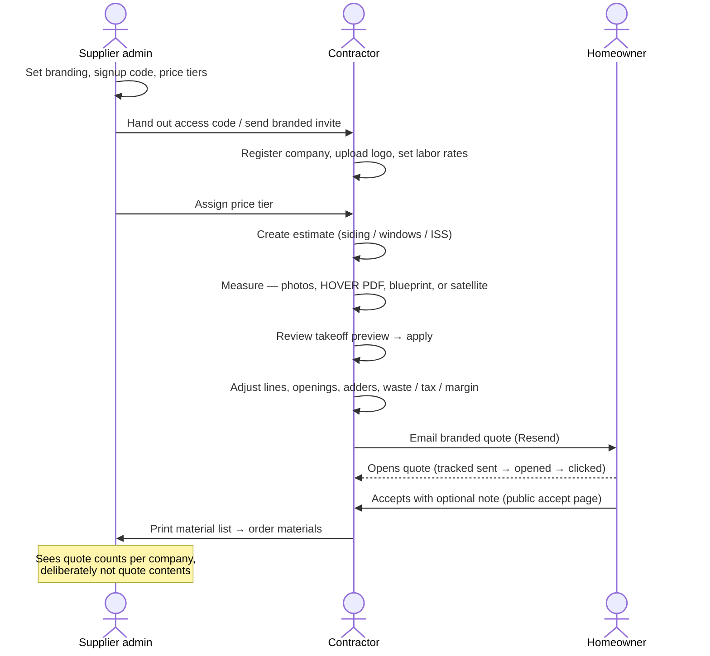
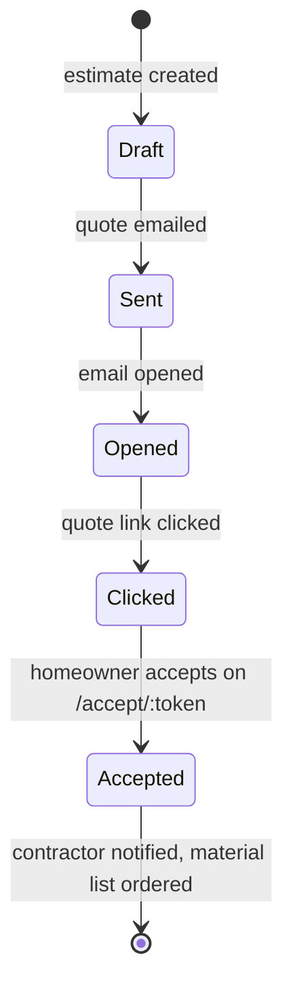
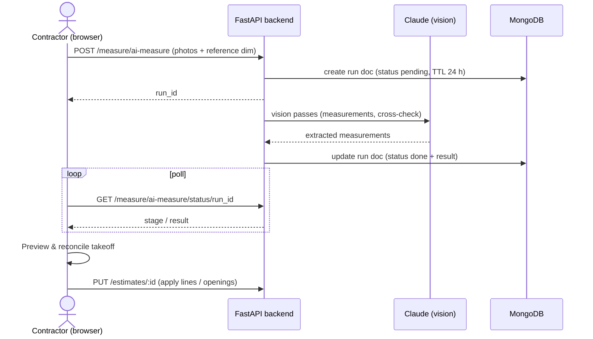

# 4. Workflow

*Part of the [Pro-Quote documentation](README.md).*

## End-to-end flow

## Quote lifecycle

Delivery events arrive via Svix-verified Resend webhooks and drive the dashboard pipeline view:

## Measurement-import flow (async AI runs)

Photo measure, blueprint, and HOVER imports run as background jobs on the backend with
status-polling endpoints; run documents expire after 24 hours (TTL indexes).

