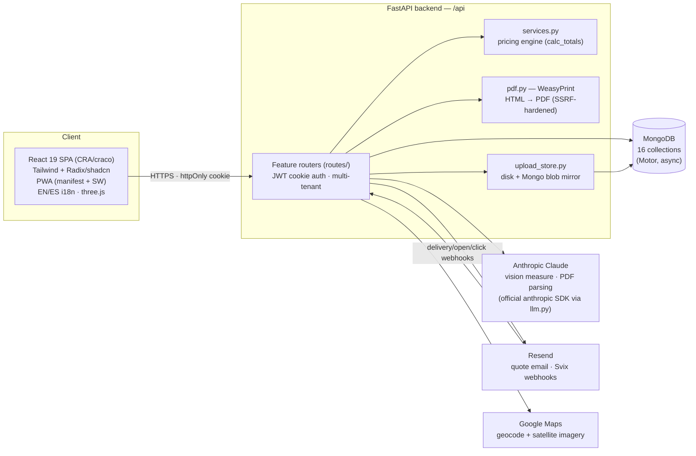
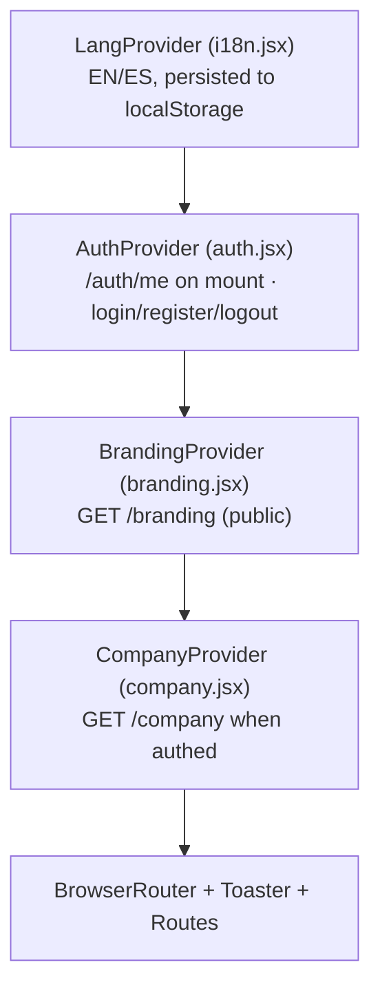

# 5. Architecture

*Part of the [Pro-Quote documentation](README.md).*

## 5.1 High level

## 5.2 Backend (`backend/`)

- **FastAPI** app (`server.py`) mounting `routes.api_router` under `/api`; CORS locked to an
  explicit allowlist (fail-closed, wildcard stripped when credentials are on).
- **Feature-per-module routers** in `routes/`: auth, company, catalog (+tier admin), estimates,
  uploads, email, public accept, Resend webhook, branding admin, pricing admin, HOVER import,
  Mezzo/Vero/ISS catalogs and pricing, LP admin preview, AI measure (+sessions), AI blueprint,
  satellite, measurement report.
- **`services.py`** — the pricing engine (`calc_totals`) and tenant/seeding helpers; the largest
  business-logic file (~72 KB).
- **`startup.py`** — idempotent boot: index creation (incl. TTL indexes on async-run collections),
  tier/Mezzo/Vero/admin seeding, schema migrations.
- **`deps.py`** — bcrypt password hashing, JWT create/verify, httpOnly cookie management,
  header-only admin-token check.
- **`pdf.py`** — WeasyPrint rendering with an SSRF-hardened URL fetcher (only `data:` and HTTPS to
  public IPs; blocks file://, private ranges, cloud metadata).
- **`upload_store.py`** — every upload is mirrored into a MongoDB blob collection so files survive
  ephemeral-container disk loss; the serve route self-heals disk from Mongo.
- **Async AI runs** — photo measure, blueprint, and HOVER imports run as background jobs with
  status-polling endpoints and 24 h TTL run documents.

## 5.3 Frontend (`frontend/`)

- **React 19** (Create React App + craco), react-router v7, axios (`withCredentials`), Tailwind +
  Radix/shadcn `components/ui`, sonner toasts, three.js for 3D elevation previews, zod +
  react-hook-form.
- **Provider tree** — branding loads publicly (the login page shows supplier branding before auth):

- **Domain logic lives in `src/lib/`**, not components: `useEstimate.js` (catalog-merge + autosave
  state machine), `calc.js` (totals), `tabsConfig.js` (tab visibility single source of truth),
  `wasteLogic.js`, `photoAnnotate.js`, `elevation3D.js`/`elevationBuilder.js`, `emailQuote.js`,
  `materialList.js`, `printTakeoff.js`, `i18n.jsx` + `dictionaries.js`.
- **Installable PWA**: manifest + cache-first service worker (never caches `/api`), iOS/Android
  install banner, mobile-first sticky totals bar. Designed for phone/tablet use in the field.
- **Bilingual** English/Spanish throughout, including the customer-facing quote and accept page.

## 5.4 External integrations

| Service | Used for | Notes |
|---|---|---|
| **Anthropic Claude** (official `anthropic` SDK, wrapped by `backend/llm.py`) | All vision/measurement AI: photo measure, blueprint reading, HOVER PDF parsing, cross-checks, OCR scale detection | Opus-class model for all runs. Keyed by `ANTHROPIC_API_KEY`. |
| **Resend** | Quote emails, acceptance notifications, contractor invites; delivery/open/click webhooks (Svix-verified) | Verified sending domain `pro-quotes.com` (SPF/DKIM/DMARC). |
| **Google Maps** | Geocoding + satellite imagery for aerial measure | `GOOGLE_MAPS_API_KEY`. |
| **HOVER** | Not an API integration — contractors upload HOVER PDFs they already own | Positioning: this app *replaces* new HOVER purchases. |
