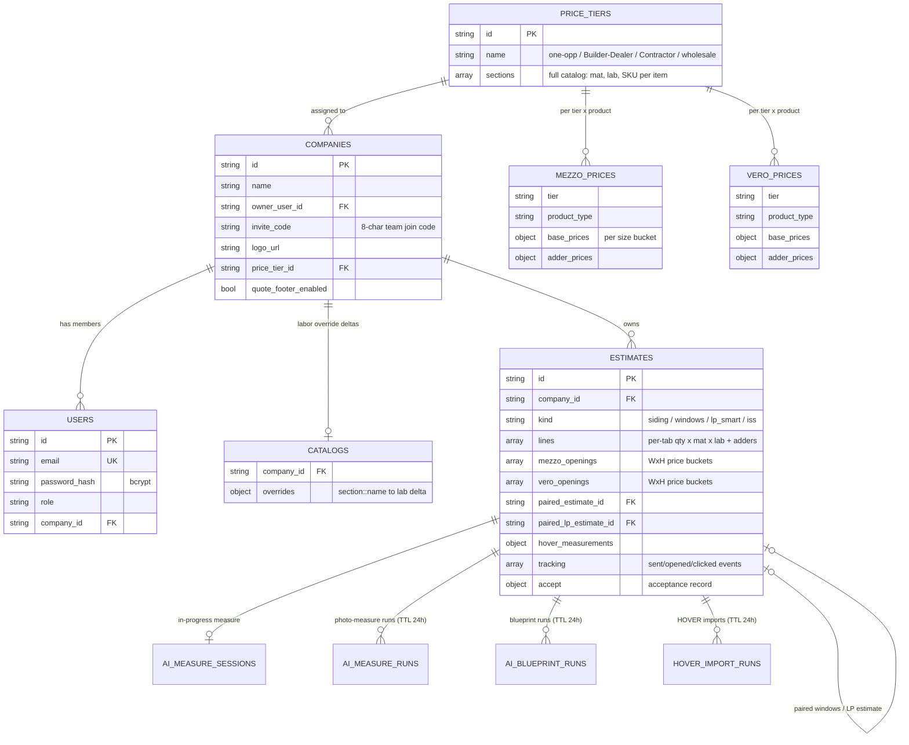

# 6. Database

*Part of the [Pro-Quote documentation](README.md).*

MongoDB (async via Motor). Connection from `MONGO_URL` / `DB_NAME`.

## Entity relationships

Standalone collections (no cross-references): `settings` (singleton supplier-branding document),
`invitations` (contractor invites sent from the admin panel), `iss_catalog` (single-tier ISS price
book), `upload_blobs` (byte-level mirror of uploaded files for disk-loss recovery), and
`hover_page_cache` (rendered PDF page images for Deep Verify, TTL 1 h).

## Collection reference

| Collection | Purpose |
|---|---|
| `users` | Contractor + admin accounts (bcrypt hash, role, company_id; unique email) |
| `companies` | Tenants: name, owner, 8-char invite code, logo, assigned price tier, quote-footer toggle |
| `estimates` | The core document: customer/job info, per-tab line items, misc rows, Mezzo/Vero openings, colors, waste/tax/margin, pairing ids, HOVER/AI measurements, email tracking events, acceptance record |
| `catalogs` | Per-company labor/material *override deltas* (base material prices come from the tier) |
| `price_tiers` | The 4 supplier price tiers, each a full sectioned catalog (mat/lab/SKU per item) |
| `mezzo_prices` | Mezzo window price matrices per (tier × product type): size-bucket base prices + adder prices |
| `vero_prices` | Vero window price docs per (tier × product type), seeded from `vero_seed_prices.json` |
| `iss_catalog` | Single-tier ISS price book |
| `settings` | Singleton supplier-branding document |
| `invitations` | Contractor invites sent from the admin panel |
| `ai_measure_runs` / `ai_blueprint_runs` / `hover_import_runs` | Async AI job status + results (TTL 24 h) |
| `ai_measure_sessions` | In-progress photo-measure working state, one per estimate |
| `hover_page_cache` | Rendered PDF page images for Deep Verify (TTL 1 h) |
| `upload_blobs` | Byte-level mirror of uploaded files (disk-loss recovery) |

**Multi-tenancy** is enforced by `company_id` scoping on every contractor query. **Indexes and TTLs**
are created idempotently at startup.

> ⚠️ **Backups**: no automated MongoDB backup/restore strategy exists in the codebase. This was
> flagged in the recorded conversation as an open operational risk (accidental deletion of a
> customer quote is currently unrecoverable). See [Known Gaps & Roadmap](10-known-gaps-roadmap.md).
