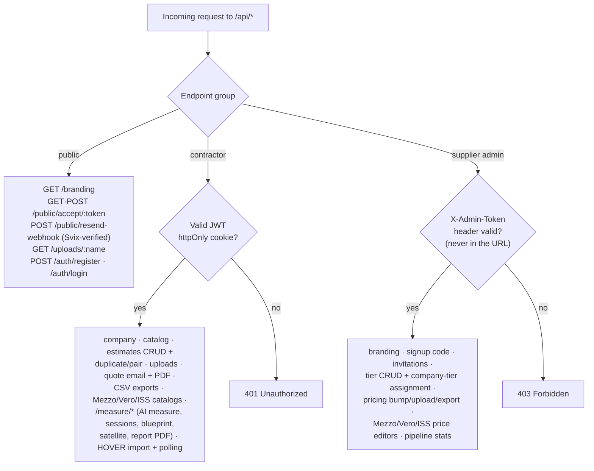

# 7. API Overview

*Part of the [Pro-Quote documentation](README.md).*

All endpoints are under `/api`. Three auth levels:

- **Public** — `GET /branding`, `GET|POST /public/accept/{token}`, `POST /public/resend-webhook`
  (Svix-signature-verified), `GET /uploads/{name}`, auth register/login.
- **Contractor (JWT httpOnly cookie)** — company, catalog, estimates CRUD + duplicate/pair,
  uploads, quote email + PDF, CSV exports, Mezzo/Vero/ISS catalogs, and the measurement suite under
  `/measure/*` (AI measure, sessions, blueprint, satellite tile, report PDF) plus HOVER import +
  status polling.
- **Supplier admin (`X-Admin-Token` header — never in the URL)** — branding, signup code,
  invitations, tier CRUD + company-tier assignment, pricing bump/upload/export, Mezzo/Vero/ISS
  price editors, cross-company pipeline stats.

Full endpoint-by-endpoint detail: see `memory/PRD.md` ("Live Endpoints") and the routers in
`backend/routes/`.

## Security posture

Hardened across a dedicated SEC-001…SEC-007 audit series:

| ID | Hardening |
|---|---|
| SEC-001 | CORS fail-closed allowlist; no wildcard with credentials |
| SEC-002 | SSRF-hardened PDF asset fetching (only `data:` and HTTPS to public IPs) |
| SEC-003 | Magic-byte upload validation |
| SEC-004 | Fail-closed secrets: boot refuses to start with a short `JWT_SECRET` or empty `ADMIN_PASSWORD` |
| SEC-005 | Login rate limiting: 5 failed attempts / IP / 15 min → 429 |
| SEC-006 | Admin token accepted in header only (URL tokens leak via logs/history) |
| SEC-007 | Strict per-user ownership of AI runs |
