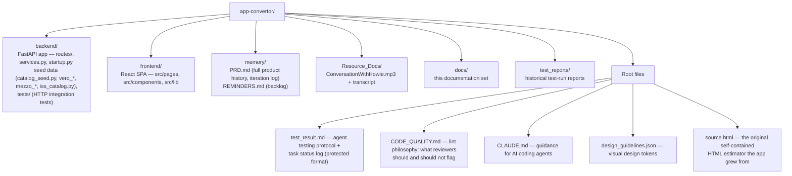

# 11. Repository Map

*Part of the [Pro-Quote documentation](README.md).*

| Path | Contents |
|---|---|
| `backend/` | FastAPI app ([Architecture §5.2](05-architecture.md)) — `routes/`, pricing engine (`services.py`), boot seeding (`startup.py`), per-brand seed data, `tests/` |
| `frontend/` | React SPA ([Architecture §5.3](05-architecture.md)) — `src/pages`, `src/components`, domain logic in `src/lib` |
| `memory/` | `PRD.md` (full product history, iteration log) · `REMINDERS.md` (backlog) |
| `Resource_Docs/` | Recorded conversation with the creator + transcript |
| `docs/` | This documentation set |
| `test_reports/` | Historical test-run reports |
| `test_result.md` | Agent testing protocol + task status log (protected format) |
| `CODE_QUALITY.md` | Lint philosophy — what reviewers should and should not flag |
| `CLAUDE.md` | Guidance for AI coding agents working in this repo |
| `design_guidelines.json` | Visual design tokens/guidelines |
| `source.html` | The original self-contained HTML estimator the app grew from |
